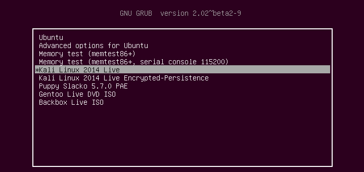

# Booting Process of Linux System

### ***Master Boot Record*** 
- the first boot loader
- 512 Bytes
    - Boot Loader
    - Partition Table
    - Magic Number(0xAA55) -hex
- could manage disks only upto 2TB
- looks for the second boot loader
    - finds it and loads the first part of it to the main memory

### ***GRUB***
- loads configurations form /boot/grub2/grub.cfg
- displays a menu to select kernel to boot
- loads vmlinuz
    - extract initramfs
- Once the kernel and the initramfs image are loaded into memory, the boot loader hands control of the boot process to the kernel.

### ***KERNEL***
- The kernel checks for the presence of the initramfs and, if found, mounts it as / and runs /init
- Kernal intitalize all hardware that are found as driver in initramfs
- To set up the user environment, the kernel executes the */sbin/init* program

### ***initramfs or initrd***
- only purpose of an initramfs is to mount the root filesystem

### ***/sbin/init (also called init)***
- PID = 1
- systemd PID = 0 (this is the first process)
- The init program is typically a shell script
    - coordinates the rest of the boot process 
    - configures the environment for the user

- When the init command starts, it becomes the parent or grandparent of all of the processes that start up automatically on the system. 

1. runs the */etc/rc.d/rc.sysinit* script
    - which sets the environment path, starts swap, checks the file systems, and executes all other steps required for system initialization
        - Eg, Clock:- rc.sysinit reads the /etc/sysconfig/clock configuration file to initialize the hardware clock. 
2. runs the */etc/inittab* script, which describes how the system should be set up in each runlevel

## ***Run Level***
- preset single digit integer for defining the operating state of OS
- */etc/rc.d* will be have a set of files/dir named rc.0, rc.1, rc.2, rc.3, rc.4, rc.5 and rc.6
- Single user mode - 1
- Multi-user mode - 5
### Various other modes (7)
0.  System halt i.e the system can be safely powered off with no activity.
1.  Single user mode.
2.  Multiple user mode with no NFS(network file system).
3.  Multiple user mode under the command line interface and not under the graphical user interface.
4.  User-definable.
5.  Multiple user mode under GUI (graphical user interface) and this is the standard run level for most of the LINUX based systems.
6.  Reboot which is used to restart the system.
