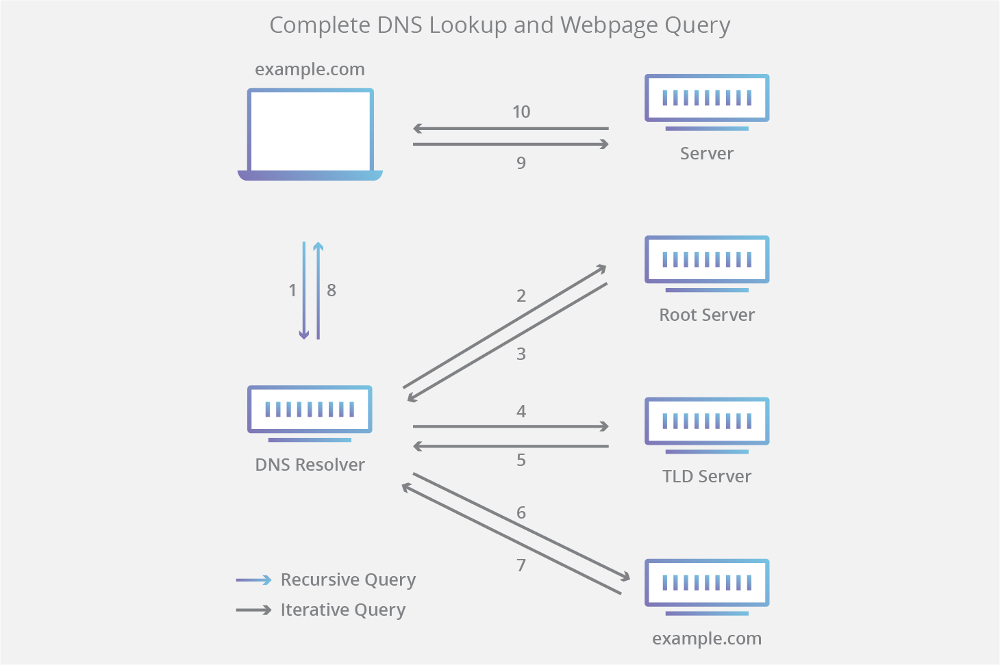

# DNS
>Domain Names are the simple human-readable names for websites. The Internet understands only IP addresses but humans give names for that IP address.

## DNS Resolution
When someone tries to use *google.com*, the browser tries to convert this by passing it through different layers and finally fetches the IP address of *google.com*. This process is called DNS resolution.

***DNS is an application layer protocol that runs on top of UDP(most of the times).***

>DNS servers usually listen on port number 53

For the web browser, the DNS lookup occurs "behind the scenes" and requires no interaction from the user’s computer apart from the initial request.

## Troubleshooting DNS

- start with the root DNS servers and perform non-recursive queries following the nameserver delegation of sub-domains until we find the authoritative DNS servers. 
- at that point, we query the server for the host information we need. 
- if the answer is correct and no errors are given, we know DNS is working properly.

Two tools exist that assist us in troubleshooting DNS:

1. dig
2. nslookup

## The 8 steps in a DNS lookup

1. A user types *example.com* into a web browser and the query travels into the Internet and is received by a DNS recursive resolver.
2. The resolver then queries a DNS root nameserver (.)
3. The root server then responds to the resolver with the address of a Top Level Domain (TLD) DNS server (such as .com or .net), which stores the information for its domains. When searching for example.com, our request is pointed toward the .com TLD
4. The resolver then makes a request to the .com TLD
5. The TLD server then responds with the IP address of the domain’s nameserver, example.com
6. Lastly, the recursive resolver sends a query to the domain’s nameserver
7. The IP address for example.com is then returned to the resolver from the nameserver
8. The DNS resolver then responds to the web browser with the IP address of the domain requested initially
### Reference
[cloudfare.com](https://www.cloudflare.com/en-in/learning/dns/what-is-dns/)