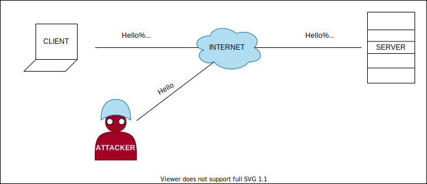
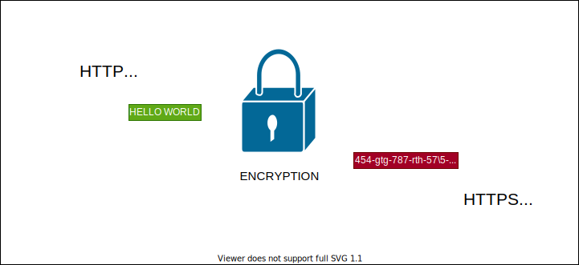

# HTTP(TLS,SSL,HTTPS)

HTTP stands for **Hyper Text Transfer Protocol**

In HTTP
- Information(data, text that is typed on that website) is sent in clear text
    - so, its vulnerable to anyone who needs to access the info

In this scenario, an attacker can easily access the data from internet as there is no encryption method implemented 

This is the reason why HTTPS is implemented

# HTTPS - HTTP with *security* feature

- Encrypts the data that is being retrieved by HTTP
    - uses encrypton algorithms to scramble the data that is being transfered

# SSL - Secure Socket Layer

> Protocol that's used to ensure security on the internet

### *uses public key encryption to secure data*

1. browser request a SSL certificate to server
2. server sents the certificate to the browser as a proof of identity
3. browser verifies 
4. server says - "ok, let's exchange the encrypted data"

# TLS - Transport Layer Security

It is a successor to SSL
- authenticates
    1.  server
    2.  clent
    3.  encrypts data

### Reference

[youtube](https://www.youtube.com/watch?v=hExRDVZHhig)