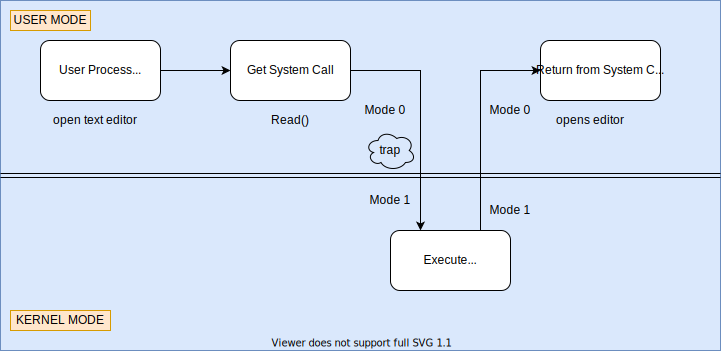

# Kernel

Kernel is a software program and the heart of operating system. It is the portion of OS code that is always resident in the main memory.

> *We can have a kernel without OS but we cannot have OS without kernel*

**Functions**

- Process Management
- Memory Management
- File system MAnagement
- Protection and security
- Device management
- Inter process communication(IPC)

## Kernel mod & User mode

**Kernel Mode** 
- Full access to Memory and I/O

**User Mode**
- Restricted access to instruction set and memory

The moment we came in read system call from Mode 1, there generates an interrupt or a trap

>Trap shifts user mode to kernel mode

Now, the control enters kernel mode from user mode and changes the mode bit to 0. Then kernel executes the system call and again returns back to the user mode by shifting mode bit to 1.

# Interrupts
- An input signal to the processor indicating an event requires immediate attention.
- The current process running on the processor gets interrupted

